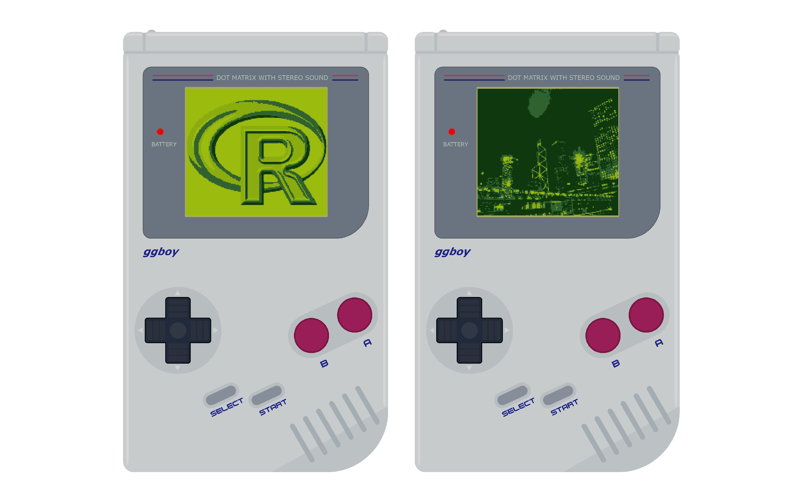
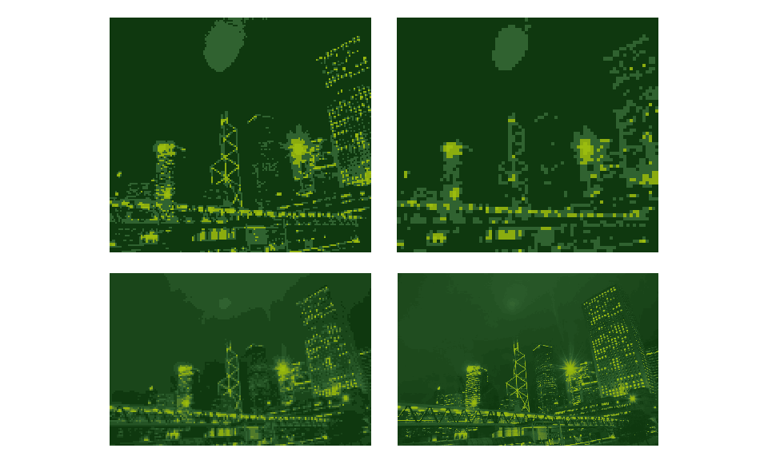
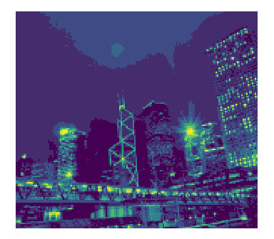
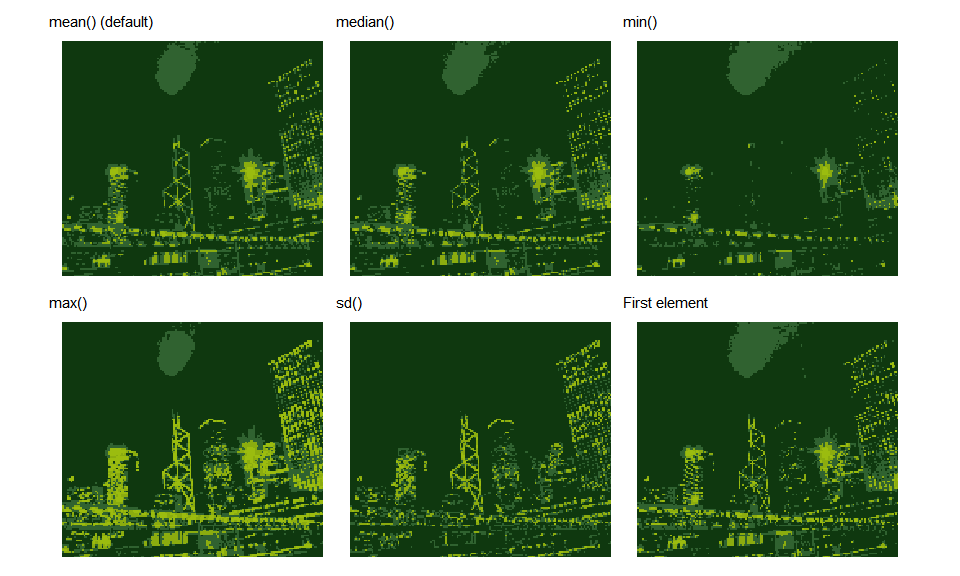

<!-- README.md is generated from README.Rmd. Please edit that file -->

# ggboy 

## Introduction

`ggboy` is a retro-gaming fix in R. It seeks to emulate the original
Game Boy (DMG-01) graphics for a supplied image.

By default, images are aggregated to be 160 units wide and 144 units
high (the original Game Boy screen aspect ratio) and made of 4 shades of
green.

All settings can be modified to adjust the output to the users
requirements.

``` r
library(ggboy)
```

`ggboy` comes with two built in matrices for demonstration purposes.

  - `rstats` - the R logo
  - `hk` - a photo I took whilst on holiday in Hong Kong back in (2008)

<!-- end list -->

``` r
ggboy(rstats)
```

<!-- -->

An approximation of the Game Boy body can be added to the plot by
setting `graphic = TRUE`.

``` r
patchwork::wrap_plots(ggboy(rstats, graphic = T), ggboy(hk, graphic = T))
```

<!-- -->

## Tuning parameters

Varying `crop`, `ncols` and `res` allows for customisation of the final
output. Setting `res = NULL` uses the maximum horizontal resolution
(after cropping if `crop = TRUE`)

``` r
patchwork::wrap_plots(
  ggboy(hk),
  ggboy(hk, res=80),
  ggboy(hk, crop=FALSE, ncols = 10),
  ggboy(hk, crop=FALSE, ncols = 30, res=NULL),
  nrow=2)
```

<!-- -->

Change number of colours and colour gradient with `ncols` and `cols`

``` r
ggboy(hk, ncols = 10, cols=viridis::viridis(5))
```

<!-- -->

## Changing aggregator

The function used to aggregate the binned pixels can be specified with
`aggregator`

``` r
library(ggplot2)
#> Warning: package 'ggplot2' was built under R version 3.6.3

patchwork::wrap_plots(
  ggboy(hk, aggregator = mean) + labs(subtitle = "mean() (default)"),
  ggboy(hk, aggregator = median) + labs(subtitle = "median()"),
  ggboy(hk, aggregator = min) + labs(subtitle = "min()"),
  ggboy(hk, aggregator = max) + labs(subtitle = "max()"),
  ggboy(hk, aggregator = sd) + labs(subtitle = "sd()"),
  ggboy(hk, aggregator = function(x) x[1]) + labs(subtitle = "First element"),
  nrow=2)
```

<!-- -->
